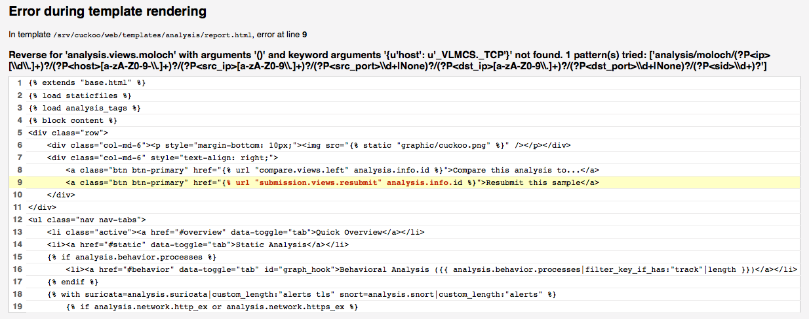
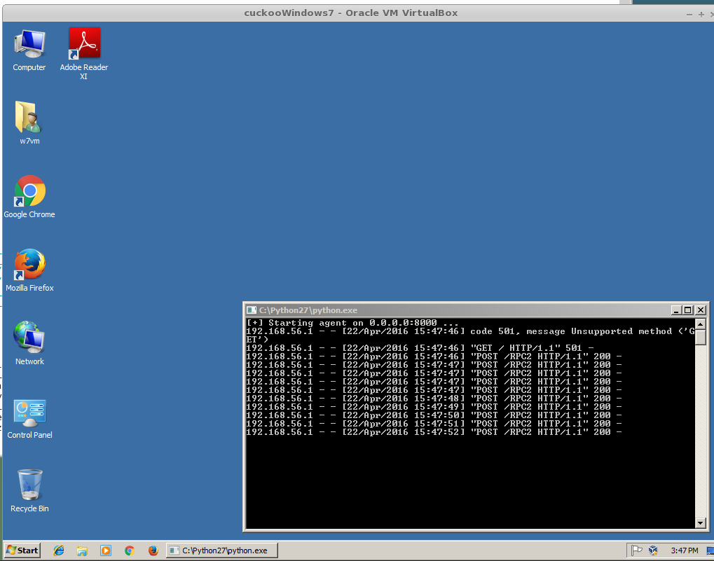

===
FAQ
===

Here you can find answers for various Frequently Asked Questions:

.. contents::
   :local:

General Questions
=================

.. _analyze_urls:

Can I analyze URLs with Cuckoo?
-------------------------------

.. versionadded:: 0.5
   Native support for URL analysis was added to Cuckoo.

.. versionchanged:: 2.0-rc1
   Cuckoo will not only start the browser (i.e., Internet Explorer) but will
   also attempt to actively instrument it in order to extract interesting
   results such as executed Javascript, iframe URLs, etc. See also our
   `2.0-rc1 blogpost`_.

Additional details on URL submissions is documented at :doc:`../usage/submit`,
but it boils down to::

    $ cuckoo submit --url http://www.example.com

.. _`2.0-rc1 blogpost`: https://cuckoosandbox.org/2016-01-21-cuckoo-sandbox-20-rc1.html

.. _general_volatility:

Can I use Volatility with Cuckoo?
---------------------------------

.. versionadded:: 0.5
   Cuckoo introduces support for optional full memory dumps, which are created
   at the end of the analysis process. You can use these memory dumps to
   perform additional memory forensic analysis with `Volatility`_.

Please also consider that we don't particularly encourage this: since Cuckoo
employs some rootkit-like technologies to perform its operations, the results
of a forensic analysis would be polluted by the sandbox's components.

.. _`Volatility`: https://github.com/volatilityfoundation/volatility

.. _esxi_reqs:

What do I need to use Cuckoo with VMware ESXi?
----------------------------------------------

To run with VMware vSphere Hypervisor (or ESXi) Cuckoo leverages on libvirt or
pyVmomi (the Python SDK for the VMware vSphere API).
VMware API are used to take control over virtual machines, though these APIs are
available only in the licensed version. In VMware vSphere free
edition these APIs are read only, so you will be unable to use it with Cuckoo.
For the minimum license needed, please have a look at VMware website.

Troubleshooting
===============

.. _troubles_upgrade:

After upgrade Cuckoo stops to work
----------------------------------

Probably you upgraded it in a wrong way.
It's not a good practice to rewrite the files due to Cuckoo's complexity and
quick evolution.

Please follow the upgrade steps described in :doc:`../installation/upgrade`.

.. _troubles_problem:

Cuckoo stumbles and produces some error I don't understand
----------------------------------------------------------

Cuckoo is a mature but always evolving project, it's possible that
you encounter some problems while running it, but before you rush into
sending emails to everyone make sure you read what follows.

Cuckoo is not meant to be a point-and-click tool: it's designed to be a highly
customizable and configurable solution for somewhat experienced users and
malware analysts.

It requires you to have a decent understanding of your operating systems, Python,
the concepts behind virtualization and sandboxing.
We try to make it as easy to use as possible, but you have to keep in mind that
it's not a technology meant to be accessible to just anyone.

That being said, if a problem occurs you have to make sure that you did everything
you could before asking for time and effort from our developers and users.
We just can't help everyone, we have limited time and it has to be dedicated to
the development and fixing of actual bugs.

    * We have extensive documentation, read it carefully. You can't just skip
      parts of it.
    * We have a `Discussion`_ page where you can find discussion platforms on
      which we're frequently helping our users.
    * We have lot of users producing content on Internet, `Google`_ it.
    * Spend some of your own time trying fixing the issues before asking ours,
      you might even get to learn and understand Cuckoo better.

Long story short: use the existing resources, put some efforts into it and don't
abuse people.

If you still can't figure out your problem, you can ask help on our online
communities (see :doc:`../finalremarks/index`).
Make sure when you ask for help to:

    * Use a clear and explicit title for your emails: "I have a problem",
      "Help me" or "Cuckoo error" are **NOT** good titles.
    * Explain **in details** what you're experiencing. Try to reproduce
      several times your issue and write down all steps to achieve that.
    * Use no-paste services and link your logs, configuration files and
      details on your setup.
    * Eventually provide a copy of the analysis that generated the problem.

.. _`Discussion`: https://cuckoosandbox.org/discussion
.. _`Google`: http://www.google.com

Check and restore current snapshot with KVM
-------------------------------------------

If something goes wrong with virtual machine it's best practice to check current snapshot
status.
You can do that with the following::

    $ virsh snapshot-current "<Name of VM>"

If you got a long XML as output your current snapshot is configured and you can skip
the rest of this chapter; anyway if you got an error like the following your current
snapshot is broken::

    $ virsh snapshot-current "<Name of VM>"
    error: domain '<Name of VM>' has no current snapshot

To fix and create a current snapshot first list all machine's snapshots::

    $ virsh snapshot-list "<Name of VM>"
     Name                 Creation Time             State
     ------------------------------------------------------------
     1339506531           2012-06-12 15:08:51 +0200 running

Choose one snapshot name and set it as current::

    $ snapshot-current "<Name of VM>" --snapshotname 1339506531
    Snapshot 1339506531 set as current

Now the virtual machine state is fixed.

Check and restore current snapshot with VirtualBox
--------------------------------------------------

If something goes wrong with virtual it's best practice to check the virtual machine
status and the current snapshot.
First of all check the virtual machine status with the following::

    $ VBoxManage showvminfo "<Name of VM>" | grep State
    State:           powered off (since 2012-06-27T22:03:57.000000000)

If the state is "powered off" you can go ahead with the next check, if the state is
"aborted" or something else you have to restore it to "powered off" before::

    $ VBoxManage controlvm "<Name of VM>" poweroff

With the following check the current snapshots state::

    $ VBoxManage snapshot "<Name of VM>" list --details
    Name: s1 (UUID: 90828a77-72f4-4a5e-b9d3-bb1fdd4cef5f)
    Name: s2 (UUID: 97838e37-9ca4-4194-a041-5e9a40d6c205) *

If you have a snapshot marked with a star "*" your snapshot is ready, anyway
you have to restore the current snapshot::

    $ VBoxManage snapshot "<Name of VM>" restorecurrent

Unable to bind result server error
----------------------------------

At Cuckoo startup if you get an error message like this one::

    2014-01-07 18:42:12,686 [root] CRITICAL: CuckooCriticalError: Unable to bind result server on 192.168.56.1:2042: [Errno 99] Cannot assign requested address

It means that Cuckoo is unable to start the result server on the IP address written
in cuckoo.conf (or in machinery.conf if you are using the resultserver_ip option inside).
This usually happen when you start Cuckoo without bringing up the virtual interface associated
with the result server IP address.
You can bring it up manually, it depends from one virtualization software to another, but
if you don't know how to do, a good trick is to manually start and stop an analysis virtual
machine, this will bring virtual networking up.

In the case of VirtualBox the hostonly interface `vboxnet0` can be created as follows::

    # If the hostonly interface vboxnet0 does not exist already.
    $ VBoxManage hostonlyif create

    # Configure vboxnet0.
    $ VBoxManage hostonlyif ipconfig vboxnet0 --ip 192.168.56.1 --netmask 255.255.255.0

Error during template rendering
-------------------------------

.. versionchanged:: 2.0-rc1

In our 2.0-rc1 release a bug was introduced that looks as follows in the
screenshot below. In order to resolve this issue in your local setup, please
open the ``web/analysis/urls.py`` file and modify the 21st line by adding an
underscore as follows::

     -        "/(?P<ip>[\d\.]+)?/(?P<host>[a-zA-Z0-9-\.]+)?"
     +        "/(?P<ip>[\d\.]+)?/(?P<host>[ a-zA-Z0-9-_\.]+)?"

The official fixes for this issue can be found in the `following`_ `commits`_.

.. _`following`: https://github.com/cuckoosandbox/cuckoo/commit/9c704f50e70227ed21ae1b79ba90540c3087fc57
.. _`commits`: https://github.com/cuckoosandbox/cuckoo/commit/558ded1787bc3377c404ac14a0b3fdce37b49bf4

501 Unsupported Method ('GET')
------------------------------

.. versionchanged:: 2.0-rc1

Since 2.0-rc1 Cuckoo supports both the `legacy Cuckoo Agent`_ as well as a
`new, REST API-based, Cuckoo Agent`_ for communication between the Guest and
the Host machine. The new ``Cuckoo Agent`` is an improved Agent in the sense
that it also allows usage outside of Cuckoo. As an example, it is used
extensively by `VMCloak`_ in order to automatically create, configure, and
cloak Virtual Machines.

Now in order to determine whether the Cuckoo Host is talking to the legacy or
new ``Cuckoo Agent`` it does a ``HTTP GET`` request to the root path (``/``).
The legacy Cuckoo Agent, which is based on ``xmlrpc``, doesn't handle that
specific route and therefore returns an error, ``501 Unsupported method``.

Having said that, the message is not actually an error, it is simply Cuckoo
trying to determine to which version of the ``Cuckoo Agent`` it is talking.

.. note::
    It should be noted that even though there is a new ``Cuckoo Agent``
    available, backwards compatibility for the legacy ``Cuckoo Agent`` is
    still available and working properly.

.. _`legacy Cuckoo Agent`: https://github.com/cuckoosandbox/cuckoo/blob/master/agent/agent.py
.. _`new, REST API-based, Cuckoo Agent`: https://github.com/jbremer/agent/blob/master/agent.py
.. _`VMCloak`: https://github.com/jbremer/vmcloak

.. _tcpdump_permission_denied:

Permission denied for tcpdump
-----------------------------

.. versionchanged:: 2.0.0

With the new Cuckoo structure in-place all storage is now, by default, located
in ``~/.cuckoo``, including the PCAP file, which will be stored at
``~/.cuckoo/storage/analyses/task_id/dump.pcap``. On Ubuntu with AppArmor
enabled (default configuration) ``tcpdump`` doesn't have write permission to
dot-directories in ``$HOME``, causing the permission denied message and
preventing Cuckoo from capturing PCAP files.

One of the workaround is as follows - by installing ``AppArmor utilities`` and
simply disabling the ``tcpdump`` AppArmor profile altogether (more appropriate
solutions are welcome of course)::

    sudo apt-get install apparmor-utils
    sudo aa-disable /usr/sbin/tcpdump

.. _pip_install_issue:

DistributionNotFound / No distribution matching the version..
-------------------------------------------------------------

.. versionchanged:: 2.0.0

Installing Cuckoo through the Python package brings its own set of problems,
namely that of outdated Python package management software. This FAQ entry
targets the following issue..::

    $ cuckoo
    Traceback (most recent call last):
    File "/usr/local/bin/cuckoo", line 5, in <module>
        from pkg_resources import load_entry_point
    File "/usr/lib/python2.7/dist-packages/pkg_resources.py", line 2749, in <module>
        working_set = WorkingSet._build_master()
    File "/usr/lib/python2.7/dist-packages/pkg_resources.py", line 446, in _build_master
        return cls._build_from_requirements(__requires__)
    File "/usr/lib/python2.7/dist-packages/pkg_resources.py", line 459, in _build_from_requirements
        dists = ws.resolve(reqs, Environment())
    File "/usr/lib/python2.7/dist-packages/pkg_resources.py", line 628, in resolve
        raise DistributionNotFound(req)
    pkg_resources.DistributionNotFound: tlslite-ng==0.6.0a3

.. as well as the following..::

    $ pip install cuckoo
    [ ... ]
    Could not find a version that satisfies the requirement tlslite-ng==0.6.0a3 (from HTTPReplay==0.1.15->Cuckoo==2.0) (from versions: 0.6.0-alpha5, 0.5.0-beta5, 0.5.0, 0.6.0-alpha4, 0.5.2, 0.5.1, 0.5.0-beta1, 0.5.0-beta2, 0.5.0-beta4, 0.5.0-beta3, 0.6.0-alpha2, 0.5.0-beta6, 0.6.0-alpha1, 0.6.0-alpha3)
    Cleaning up...
    No distributions matching the version for tlslite-ng==0.6.0a3 (from HTTPReplay==0.1.15->Cuckoo==2.0)
    Storing debug log for failure in /home/cuckoo/.pip/pip.log

Those issues - and related ones - are caused by outdated Python package
management software. Fortunately their fix is fairly trivial and therefore
the following command should do the trick::

    pip install -U pip setuptools

.. _openfiles24:

IOError: [Errno 24] Too many open files
---------------------------------------

It is most certainly possible running into this issue when analyzing samples
that have a lot of dropped files, so many that the :ref:`cuckoo_process` can't
allocate any new file descriptors anymore.

The easiest workaround for this issue is to bump the soft and hard file
descriptor limit for the current user. This may be done as documented in the
`following blogpost <https://easyengine.io/tutorials/linux/increase-open-files-limit/>`_.

In case if you using **Supervisor** set ``minfds`` in **supervisord.conf**.

Remember that you have to login in to a new shell (i.e., usually logout first)
session in order for the changes to take effect.

pkg_resources.ContextualVersionConflict
---------------------------------------

In case you're installing or upgrading the Cuckoo Package, it has happened
before to people that they got an error much like the following::

    pkg_resources.ContextualVersionConflict: (HTTPReplay 0.1.5
    (/usr/local/lib/python2.7/dist-packages),
    Requirement.parse('HTTPReplay==0.1.17'), set(['Cuckoo']))

Now this is quite odd, as generally speaking we've specifically requested
``pip`` to install all dependencies with their exact version (and in fact,
if you look at ``pip freeze`` you'll see the correct version), but it does
happen sometimes that older versions of various libraries are still around.

The easiest way to resolve this issue is by uninstalling ``all`` versions of
said dependency and reinstalling Cuckoo. In the case presented above, with
``HTTPReplay``, this may look as follows::

    $ sudo pip uninstall httpreplay
    Uninstalling HTTPReplay-0.1.17:
    /usr/local/bin/httpreplay
    /usr/local/bin/pcap2mitm
    /usr/local/lib/python2.7/dist-packages/HTTPReplay-0.1.17-py2.7.egg-info
    ...
    Proceed (y/n)? y
    Successfully uninstalled HTTPReplay-0.1.17

    $ sudo pip uninstall httpreplay
    Uninstalling HTTPReplay-0.1.5:
    /usr/local/lib/python2.7/dist-packages/HTTPReplay-0.1.5-py2.7.egg-info
    Proceed (y/n)? y
    Successfully uninstalled HTTPReplay-0.1.5

    $ sudo pip uninstall httpreplay
    Cannot uninstall requirement httpreplay, not installed

Then reinstalling Cuckoo again is simply invoking ``pip install -U cuckoo`` or
similar.

ValueError: incomplete format key
---------------------------------

This issue may appear at runtime after tinkering with settings in ``$CWD/conf``,
as input is passed to the configuration parser at runtime unescaped. Double-check your
configuration files with an eye out for potentially troublesome character
combinations such as ``%(``.

Troubleshooting VM network configuration
----------------------------------------

In case the network configuration of your Virtual Machine isn't working as
expected, you'll be prompted with the message to resolve this issue as Cuckoo
isn't able to use it for analyses as-is. There are numerous possibilities as
to why the network configuration and/or your setup are incorrect so please
read our documentation once more. However, most often the issue lies within
one of the following reasons:

* The IP address of the VM has been configured incorrectly. Please verify that
  the VM has a static IP address, that it matches the one in the Cuckoo
  configuration, and that the configured network interface exists and is up.
  Also, in case of VirtualBox, did you configure the network interface to be a
  ``Host-Only interface``?
* Check that there are no firewalls in-place that hinder the communication
  between your Host and Guest and double check that the Host and Guest can
  ping each other as well as connect to each other.

If connections from the Cuckoo Host to the Guest work, but the other way
around don't, then some additional problems may be at hand:

* Is the network configuration equivalent on the host and in the VM? If not,
  e.g., if the VM sees different IP ranges, then you'll have to configure the
  ``resultserver_ip`` and ``resultserver_port``, for which we have separate
  documentation.
* If you've modified the Cuckoo Analyzer (located at ``$CWD/analyzer``) this
  error message may indicate that a syntax error or other exception was
  introduced, preventing the Analyzer from being properly started, and thus
  not being able to perform the analysis as expected.

If you've triple-checked the above and are still experiencing issues, then
please contact us through one of the various communication channels.

Cuckoo says there's a version 2.1.0?
------------------------------------

If you see the message ``Outdated! Cuckoo Sandbox version 2.1.0 is available
now.`` and you've come to this FAQ entry then you're entirely correct. There
is indeed no version ``2.1.0``, yet (!). However, due to the logic implemented
in the version checker of our ``2.0-RC1`` and ``2.0-RC2`` releases, the only
way to inform our users about our latest releases is by having a *"new"* major
version release (i.e., ``2.1.0`` or later).
We've decided that it's better to sling a little bit of confusion regarding a
non-existing version than not mentioning any new versions to our users
altogether. So please bear with us and install the latest version :-)

No handlers could be found for logger X in UWSGI log
----------------------------------------------------

If you see this message, it means Cuckoo is throwing an error before its loggers are initialized. 
This might happen if database migration or CWD updates are required.

Start the development web server to see the error::

    $ cuckoo web
