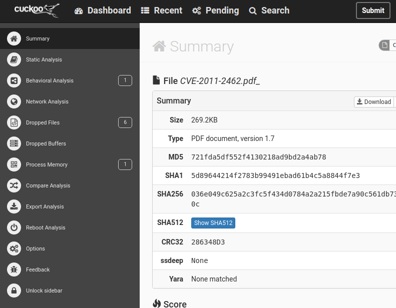
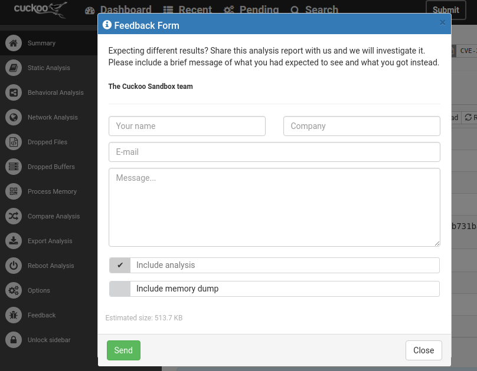

.. _feedback:

===============
Cuckoo Feedback
===============

.. versionadded:: 2.0.0

The Cuckoo Feedback form allows users to **provide instant feedback** to the
Cuckoo Core Developer team. By doing so, our development team will be able to
more **quickly react** upon errors, partially incorrect analysis results,
errors occurred during an analysis or in the web interface, and anything else
that our users think requires some extra attention.
All in all, this optional feature gives those users that are interested in a
*second opinion* the ability to do so in a convenient way for both the user as
well as the team behind Cuckoo Sandbox.

.. note::
   As a user you are able to ping back to us through the Cuckoo Feedback from
   embedded in most pages of the web interface (e.g., an analysis page or a
   404 page not found / 500 internal error page).

Following a screenshot of a part of the *new* (as of Cuckoo 2.0.0) analysis
results page with the side bar *locked in* (i.e., permanently open).

At the bottom of the side bar you'll see the ``Feedback`` button which will
pop up the following feedback form. Naturally filling out all of the fields in
this form will allow you to send us feedback (in a secure manner).

It should be noted that, may you decide to provide feedback on a regular, you
can also fill out your name, company, and email address (where you'll receive
any answers) in the ``$CWD/conf/cuckoo.conf`` configuration file so those will
be auto-filled for you upon opening the feedback form.

